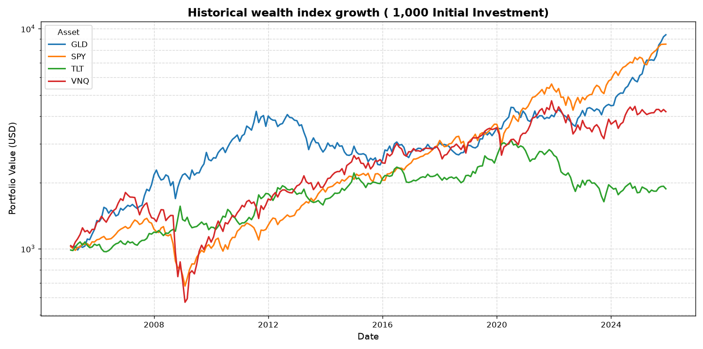
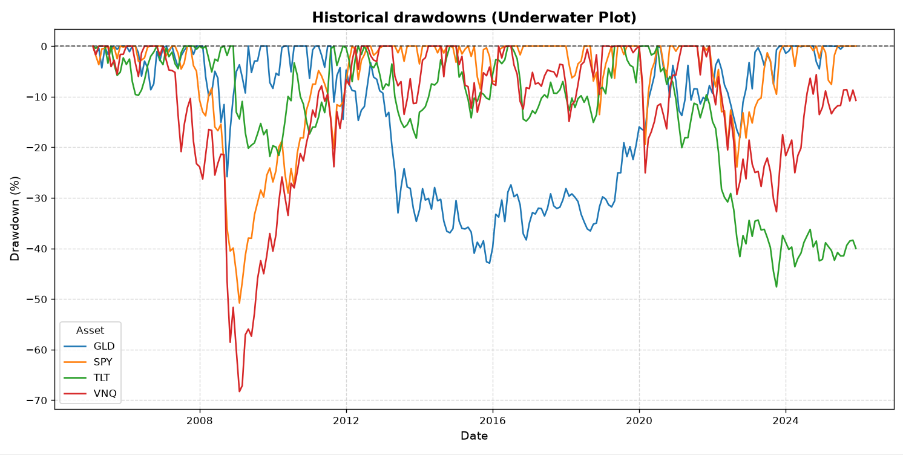
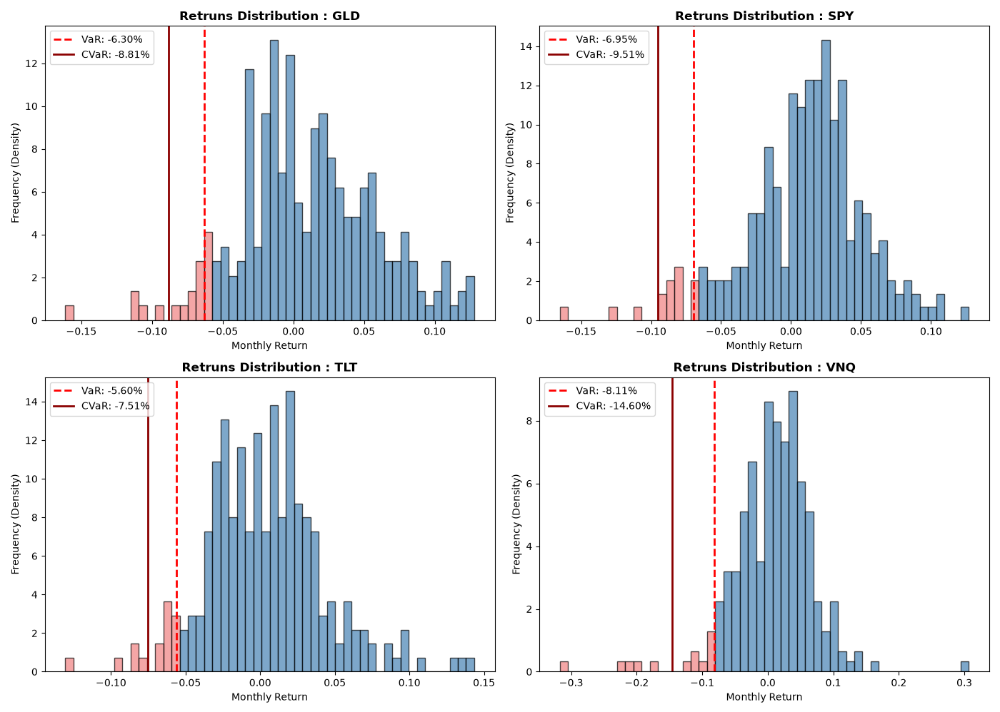

# Quantitative Risk & Performance Profiling

A Python module for historical financial data analysis, risk metrics computation, and performance evaluation across multi-asset portfolios.

The pipeline is fully dynamic and highly customizable: it automatically scales for any number of assets or timeframes, and lets you easily adjust core metrics like the Risk-Free Rate, Confidence level and periods per year.

### Features
1. Automated data fetching using `yfinance`
2. Monthly compound return computation 
3. Compounded Annual Growth Rate -CAGR- using geometric compounding
4. Annualized Volatility calculation scaled by the square root of periods
5. Sharpe Ratio computation relative to a customizable Risk-Free Rate
6. Cumulative Peak tracking and Maximum Drawdown analysis
7. Adjustable Monthly VaR and CVaR measurement
8. Dynamic charts that automatically adjust to the number of assets you analyze.

### Default Configuration (Example Portfolio)
The default setup analyzes 4 main asset classes from 2005 to 2025
1. SPY - US Equities (S&P500)
2. GLD - Gold Trust
3. TLT - 20+ Year Treasury Bonds
4. VNQ - Real Estate 

### Project Structure
1. `config.py` - Settings configuration
2. `data_loader.py` - Fetches adjusted monthly closing prices
3. `analytics.py` - Vectorized financial formulas
4. `utils.py` - Tabular reporting and dynamic formatting
5. `plots.py` - Visualization engine
6. `main.py` - Pipeline execution and results summary

### Example Output
  MULTI-ASSET RISK-RETURN SUMMARY (2005 - 2025) 
╒══════════╤════════╤═════════════════════════╤════════════════════════╤════════════════╤═════════════════════╤══════════════════════╕
│ Ticker   │ CAGR   │ Annualized Volatility   │   Sharpe Ratio (Rf=2%) │ Max Drawdown   │ Monthly VaR (95%)   │ Monthly CVaR (95%)   │
╞══════════╪════════╪═════════════════════════╪════════════════════════╪════════════════╪═════════════════════╪══════════════════════╡
│ GLD      │ 11.30% │ 16.73%                  │                   0.56 │ -42.91%        │ 6.30%               │ 8.81%                │
├──────────┼────────┼─────────────────────────┼────────────────────────┼────────────────┼─────────────────────┼──────────────────────┤
│ SPY      │ 10.78% │ 14.82%                  │                   0.59 │ -50.78%        │ 6.95%               │ 9.51%                │
├──────────┼────────┼─────────────────────────┼────────────────────────┼────────────────┼─────────────────────┼──────────────────────┤
│ TLT      │ 3.04%  │ 13.71%                  │                   0.08 │ -47.61%        │ 5.60%               │ 7.51%                │
├──────────┼────────┼─────────────────────────┼────────────────────────┼────────────────┼─────────────────────┼──────────────────────┤
│ VNQ      │ 7.10%  │ 21.63%                  │                   0.24 │ -68.30%        │ 8.11%               │ 14.60%               │
╘══════════╧════════╧═════════════════════════╧════════════════════════╧════════════════╧═════════════════════╧══════════════════════╛

### Sample Visualizations




### How to Run
```bash
pip install pandas numpy matplotlib yfinance tabulate
python main.py 
```